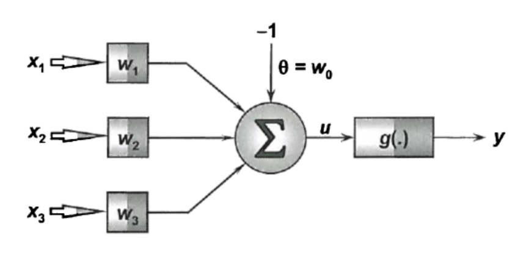

# TensorFlow Perceptron Classifier

A single-layer Perceptron implemented with TensorFlow and Keras for the automatic classification of two petroleum-oil purity classes.

## Overview

This project classifies oil samples obtained from a fractional distillation process. Classification is based on measurements of three physicochemical properties. The model learns a linear decision boundary that separates the two purity classes.

### Class convention

- **P1:** represented by the target value `-1`
- **P2:** represented by the target value `1`

## Model architecture

The classifier is a single-neuron Perceptron with three inputs (`x₁`, `x₂`, and `x₃`), a bias input of `-1`, and the associated bias weight `θ = w₀`. The weighted inputs are combined by a linear summation unit `u`, followed by a linear activation function that produces the output `y`.



The neuron computes a linear response of the form:

```text
u = w₀(-1) + w₁x₁ + w₂x₂ + w₃x₃
```

and uses the linear activation function to generate `y`.

## Training

The model is trained using the Adam gradient-descent optimizer with a learning rate of `0.05`. The repository also features custom convergence callbacks to monitor training and identify when the model has converged.

| Component | Configuration |
| --- | --- |
| Model | Single-layer Perceptron |
| Inputs | Three physicochemical measurements |
| Output | Linear neuron output `y` |
| Classes | `-1` (P1) and `1` (P2) |
| Optimizer | Adam |
| Learning rate | `0.05` |
| Framework | TensorFlow and Keras |

## Development environment

The project is designed to run in a Jupyter Notebook, including Google Colab, with TensorFlow 2.x or later and Keras.
